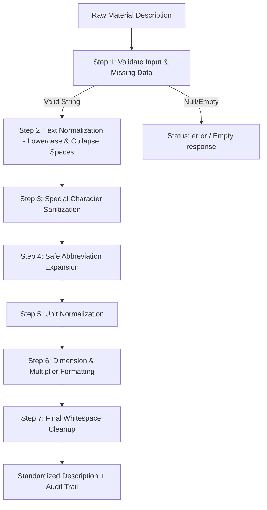

# AI-Driven Standardization and Harmonization of Material Codes Across CPSEs
## Phase 1: Data Ingestion & Text Preprocessing Backend Engine

A modular, deterministic text preprocessing engine and data ingestion API built with **FastAPI**, **Pandas**, **Pydantic**, and **Regex**.

---

## 🎯 Phase Scope & Objectives

In this initial phase of the SIH project, the backend provides:
- **Deterministic 7-Step Cleaning Pipeline**: Cleans, standardizes, and normalizes legacy CPSE material descriptions without relying on heavy AI or non-deterministic models.
- **Traceable Transformation Audit Trail**: Explains every single modification (lowercasing, special characters removed, abbreviation expansions, dimension formatting, unit conversions) made to each record.
- **Batch CSV Ingestion**: Parses uploaded CSV catalogs, auto-detects material description columns, enriches records, and preserves original metadata.
- **Configurable Dictionaries**: Easily extend industrial abbreviations and engineering units dynamically.
- **CORS Enabled**: Seamlessly integrates with Next.js dashboards.

---

## 🧱 Project Architecture

```
backend/
│
├── app/
│   ├── __init__.py
│   ├── main.py                     # FastAPI application factory, CORS, and lifespan config
│   ├── api/
│   │   ├── __init__.py
│   │   └── routes.py               # API route definitions (/health, /process/*, /abbreviations, /units)
│   ├── services/
│   │   ├── __init__.py
│   │   └── preprocessing_service.py# 7-step deterministic preprocessing engine & audit tracker
│   ├── utils/
│   │   ├── __init__.py
│   │   ├── abbreviations.py        # Configurable abbreviation dictionary & regex boundary matcher
│   │   └── unit_normalizer.py      # Standard SI unit mapping & dimension syntax standardizer
│   ├── models/
│   │   ├── __init__.py
│   │   └── schemas.py              # Pydantic validation & response schemas
│   └── config/
│       ├── __init__.py
│       └── settings.py             # Global settings, column detection heuristics, CORS
│
├── tests/
│   ├── __init__.py
│   └── test_preprocessing.py       # Comprehensive pytest suite for unit & API tests
├── sample_data/
│   └── raw_materials_sample.csv    # Sample CPSE material catalog for testing
├── requirements.txt                # Python dependencies
└── README.md                       # Backend technical documentation
```

---

## ⚙️ 7-Step Preprocessing Pipeline



1. **Step 1 — Handle Missing / Invalid Data**: Detects `None`, `NaN`, or empty strings. Preserves the raw value unchanged.
2. **Step 2 — Text Normalization**: Converts characters to lowercase and collapses internal whitespace.
3. **Step 3 — Special Character Cleaning**: Strips noisy symbols (`!`, `@`, `#`, `$`, `%`, `^`, `&`, `~`, repeated punctuation) while protecting decimals (`2.5`) and dimensional operators. Converts word-hyphens (`hex-bolt`) into spaces (`hex bolt`).
4. **Step 4 — Abbreviation Expansion**: Matches shorthand (`ss`, `ms`, `gi`, `cu`, `dia`, `thk`, `brg`, `galv`, `cs`, `ci`, etc.) with safe regex boundaries (`(?<![a-zA-Z0-9])...(?![a-zA-Z0-9])`) to avoid false-positive matches inside words (`brass`, `class`, `diagram`).
5. **Step 5 — Unit Normalization**: Maps variations to canonical SI representations (`MM` $\to$ `mm`, `MTR` $\to$ `m`, `INCH` / `"` $\to$ `inch`, `SQMM` $\to$ `sq mm`, `NOS` $\to$ `nos`, `PCS` $\to$ `pcs`, `KV` $\to$ `kv`).
6. **Step 6 — Dimension Formatting**: Standardizes multipliers and number-unit spacing (`M10X50` $\to$ `m10 x 50`, `M10*50` $\to$ `m10 x 50`, `2MM` $\to$ `2 mm`, `4SQMM` $\to$ `4 sq mm`, `1/2"` $\to$ `1/2 inch`).
7. **Step 7 — Final Whitespace Cleanup**: Strips leading/trailing spaces and deduplicates spaces.

---

## 🚀 Quick Start

### 1. Install Dependencies
```bash
cd backend
pip install -r requirements.txt
```

### 2. Run the Development Server
```bash
uvicorn app.main:app --reload --host 0.0.0.0 --port 8000
```
- API Base URL: `http://localhost:8000`
- Interactive Swagger Docs: `http://localhost:8000/docs`
- ReDoc Documentation: `http://localhost:8000/redoc`

### 3. Run Automated Tests
```bash
pytest tests/test_preprocessing.py -v
```

---

## 📡 API Endpoints & Examples

### 1. Health Check
`GET /health`

**Response:**
```json
{
  "status": "healthy",
  "service": "SIH Material Standardization Preprocessing Engine",
  "version": "1.0.0",
  "timestamp": "2026-09-08T23:45:00.000000+00:00"
}
```

---

### 2. Process Single Material Description
`POST /process/material`

**Request Body:**
```json
{
  "material_description": "SS HEX-BOLT M10X50 MM!!!"
}
```

**Response:**
```json
{
  "raw_description": "SS HEX-BOLT M10X50 MM!!!",
  "cleaned_description": "stainless steel hex bolt m10 x 50 mm",
  "changes": [
    "Converted text to lowercase",
    "Removed unnecessary special characters",
    "Expanded abbreviation: ss → stainless steel",
    "Standardized dimension formatting: m10x50 → m10 x 50",
    "Normalized measurement unit: MM → mm"
  ],
  "processing_status": "success"
}
```

---

### 3. Batch CSV Ingestion & Preprocessing
`POST /process/csv`

Uploads a CSV file with `multipart/form-data`. Auto-detects columns like `material_description`, `description`, `item_desc`, or uses the `?column_name=` parameter.

**cURL Example:**
```bash
curl -X POST "http://localhost:8000/process/csv" \
  -H "accept: application/json" \
  -H "Content-Type: multipart/form-data" \
  -F "file=@sample_data/raw_materials_sample.csv"
```

**Response Summary:**
```json
{
  "summary": {
    "total_rows": 10,
    "processed_rows": 10,
    "success_count": 10,
    "error_count": 0,
    "detected_description_column": "material_description",
    "processing_time_ms": 14.85
  },
  "records": [
    {
      "material_id": "MAT-001",
      "cpse_organization": "ONGC",
      "material_description": "SS HEX-BOLT M10X50 MM!!!",
      "category": "Fasteners",
      "unit_of_measure": "NOS",
      "storage_location": "Mumbai-Yard-1",
      "cleaned_description": "stainless steel hex bolt m10 x 50 mm",
      "changes_made": [
        "Converted text to lowercase",
        "Removed unnecessary special characters",
        "Expanded abbreviation: ss → stainless steel",
        "Standardized dimension formatting: m10x50 → m10 x 50",
        "Normalized measurement unit: MM → mm"
      ],
      "processing_status": "success"
    }
  ]
}
```

---

### 4. Manage Abbreviations
- `GET /abbreviations`: Retrieve all active abbreviations.
- `POST /abbreviations`: Register custom domain-specific shorthand mappings.

**Request Body for POST:**
```json
{
  "abbreviations": {
    "ss": "stainless steel",
    "nbr": "nitrile butadiene rubber"
  }
}
```

---

### 5. Inspect Units Mapping
`GET /units`: Retrieve all supported SI and industrial unit variants.

---

## 🔮 Future Roadmap (Next Phases)
1. **Attribute Extraction**: Extract material grade, diameter, length, class, pressure rating into structured JSON.
2. **NLP & Embedding Pipeline**: Generate dense semantic embeddings using Sentence Transformers.
3. **Vector Database / pgvector**: Store embeddings for cross-CPSE semantic index search.
4. **AI Material Matching & Duplicate Clustering**: Group duplicate materials across CPSE catalogs with similarity scores.
